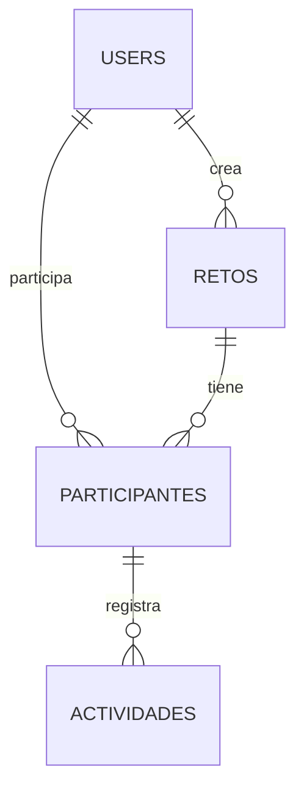

# Proyecto Final - Plataforma de Retos Personales

## 1. Datos generales
- Materia: Desarrollo Web Avanzado
- Framework: Laravel 12
- Frontend: Blade + Tailwind (Breeze)
- Base de datos objetivo: MySQL
- Base temporal usada durante montaje: SQLite

## 2. Objetivo del sistema
Desarrollar una plataforma web donde los usuarios creen retos personales, lleven seguimiento y registren actividades. El sistema incluye autenticacion, roles, CRUD completo y API REST para retos.

## 3. Tecnologias usadas
- PHP 8.x
- Laravel 12
- Laravel Breeze (Blade)
- Eloquent ORM
- MySQL (configurado)
- SQLite (para desarrollo temporal)
- Vite + TailwindCSS

## 4. Desarrollo paso por paso

### Paso 1 - Instalacion del proyecto Laravel
Se creo el proyecto desde cero con Composer.

Comando usado:

```bash
composer create-project laravel/laravel retos-personales
```

### Paso 2 - Configuracion de base de datos
Se dejo la app configurada para MySQL en archivo de entorno.

Archivo editado: .env

```env
DB_CONNECTION=mysql
DB_HOST=127.0.0.1
DB_PORT=3306
DB_DATABASE=retos_personales
DB_USERNAME=root
DB_PASSWORD=
```

Tambien se actualizo .env.example con la misma configuracion base.

### Paso 3 - Autenticacion con Breeze
Se instalo Breeze con Blade para login, registro, dashboard y perfil.

Comandos usados:

```bash
composer require laravel/breeze --dev
php artisan breeze:install blade
npm install
npm run build
```

### Paso 4 - Diseno de base de datos y migraciones
Se implementaron tablas relacionadas:
- users (incluye campo role)
- retos
- participantes
- actividades

Migraciones clave:
- database/migrations/0001_01_01_000000_create_users_table.php
- database/migrations/2026_05_11_194115_create_retos_table.php
- database/migrations/2026_05_11_194216_create_participantes_table.php
- database/migrations/2026_05_11_194216_create_actividades_table.php

### Paso 5 - Modelos y relaciones
Se crearon modelos con fillable, casts y relaciones:
- User
- Reto
- Participante
- Actividad

Nota tecnica importante:
- En Actividad se fijo el nombre de tabla con:

```php
protected $table = 'actividades';
```

Esto evita pluralizacion incorrecta a actividads.

### Paso 6 - CRUD en controladores
Se implemento CRUD completo:
- RetoController
- ParticipanteController
- ActividadController

Con validaciones en store y update usando Request validate.

### Paso 7 - Roles y middleware
Se implemento middleware personalizado EnsureRole y alias role.

- Archivo middleware: app/Http/Middleware/EnsureRole.php
- Registro de alias: bootstrap/app.php

Proteccion de rutas:
- Usuarios autenticados: retos
- Solo admin: participantes y actividades

### Paso 8 - Vistas Blade y navegacion
Se crearon vistas con layout reutilizable para:
- retos (index, create, edit, show)
- participantes (index, create, edit, show)
- actividades (index, create, edit, show)

Se actualizo menu de navegacion para mostrar opciones segun rol.

### Paso 9 - API REST de retos
Se creo controlador API y rutas para minimo 5 endpoints.

Endpoints implementados:
- GET /api/retos
- POST /api/retos
- GET /api/retos/{id}
- PUT /api/retos/{id}
- PATCH /api/retos/{id}
- DELETE /api/retos/{id}

### Paso 10 - Seeders con datos de prueba
Se cargo Data Seeder con:
- 1 usuario admin
- 1 usuario normal
- 2 retos
- 2 participantes
- 3 actividades

Comando de carga:

```bash
php artisan migrate:fresh --seed
```

## 5. Diagrama de base de datos

### 5.1 Mermaid ER



### 5.2 Archivo fuente del diagrama
- docs/diagrama_base_de_datos.mmd

## 6. Pruebas funcionales recomendadas

1. Registro y login de usuario.
2. Crear, editar y eliminar un reto.
3. Verificacion de restriccion por rol (admin vs usuario).
4. Crear participante y actividad desde cuenta admin.
5. Consumo de endpoints API con Postman.

## 7. Capturas sugeridas para evidencia
Colocar en el reporte final estas capturas:
1. Pantalla login y registro.
2. Dashboard autenticado.
3. CRUD de retos (index + create + edit).
4. Vista de participantes y actividades en admin.
5. Prueba de API (GET y POST).
6. Error 403 al intentar ruta admin con usuario normal.

## 8. Estado actual del proyecto
- Laravel instalado y funcionando.
- Breeze instalado y compilado.
- Modelo relacional completo.
- CRUD web completo.
- Roles y middleware activos.
- API REST de retos activa.
- Seeders de prueba implementados.
- Configuracion lista para MySQL.

## 9. Comandos de ejecucion

```bash
# dentro de la carpeta retos-personales
php artisan migrate:fresh --seed
php artisan serve
```

Si usas frontend en modo desarrollo:

```bash
npm run dev
```

## 10. Credenciales de prueba
- Admin:
  - correo: admin@retos.test
  - password: password
- Usuario:
  - correo: usuario@retos.test
  - password: password

## 11. Conclusiones
Se cumplieron los requisitos principales del proyecto final: framework Laravel, base de datos relacional con minimo 3 tablas relacionadas, autenticacion, roles, CRUD completo en web, API REST con mas de 5 endpoints, seeders y documentacion tecnica.
